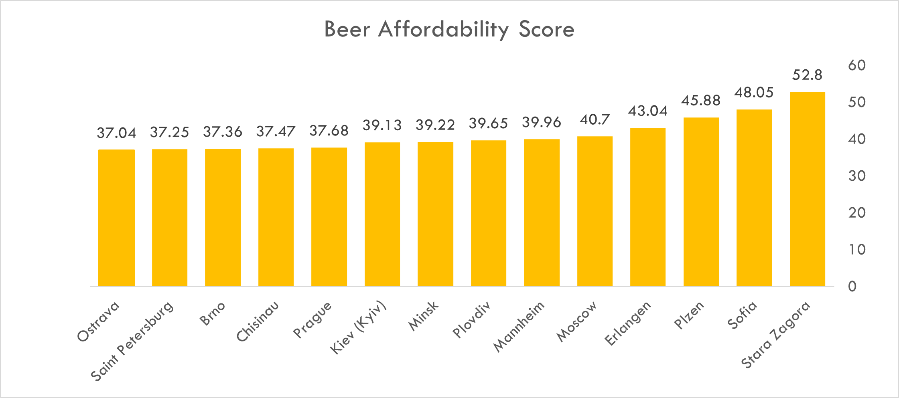

🌍 European Cost of Living & Lifestyle Value Analysis

📌 Project Overview
This project analyses cost-of-living data for European cities. Instead of looking at raw prices, I developed a 'Beer Affordability Index' to measure 'Lifestyle Value', how much local leisure a resident can afford on a local salary.

📁 Dataset
Source: [Numbeo Cost of Living Database](https://www.numbeo.com/cost-of-living/)
Data points: Cost of living indices, rent, groceries, restaurant prices, 
local purchasing power, average salary estimates
Time period: February 2026

🛠️ Tools Used
Excel: Data cleaning, Pivot Tables, and Dashboard design.
Calculated Metrics: Created a custom index: Purchasing Power / Price of Local Goods.
GitHub: Version control and project documentation.

📊 The Dashboard

💡 Top 3 Discoveries
Capital Fatigue: Residents in London/Paris pay a 40% "premium" for city-living that isn't always matched by salary increases.
Economic Sweet Spots: Cities such as Erlangen (Germany) offer the optimal balance of high wages and moderate costs.
East vs West: While Western Europe has higher raw wealth, Central/Eastern European cities provide a better 'lifestyle-to-labour' ratio.
